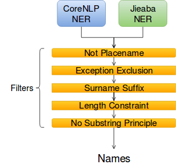
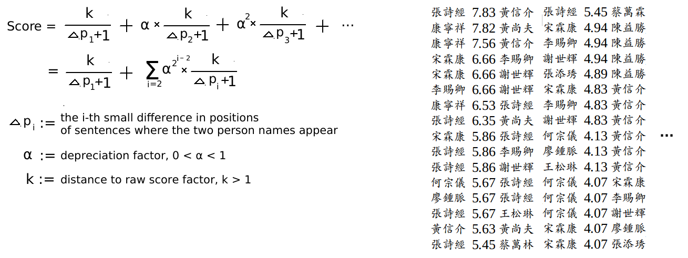
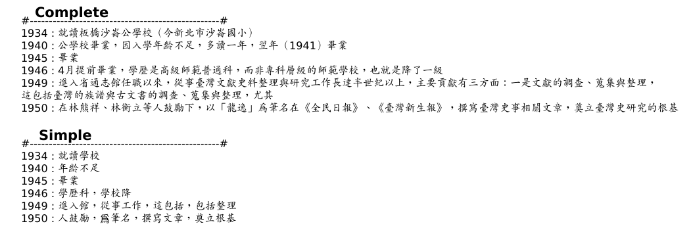

# Information_Extraction_from_Biographies
An exploration on NLP methods for information extraction from biographies, with *Extended Taipei Gazetteers*.  
  
[Proposed NLP Methods Overview](#proposed-nlp-methods-overview)  
&nbsp;&nbsp;&nbsp;[1. Name Entity Recognition](#1-name-entity-recognition-ner)  
&nbsp;&nbsp;&nbsp;[2. Relation Extraction](#2-relation-extraction)  
&nbsp;&nbsp;&nbsp;[3. Weighted Cooccurrence Rank](#3-weighted-cooccurrence-rank)  
&nbsp;&nbsp;&nbsp;[4. Automatic Timeline Generation](#4-automatic-timeline-generation)  
[Usage](#usage)  
[Github Wiki for more](https://github.com/richardyy1188/Information_Extraction_from_Biographies/wiki)

# Proposed NLP Methods Overview
We propose and implement some new NLP methods for information extraction.
## 1. Name Entity Recognition (NER)
Increase recall by using multiple NER tools with auxiliary information, then increase precision by applying some filters and principles.  
  

  
[(detail...） ](https://github.com/richardyy1188/Information_Extraction_from_Biographies/wiki/Name-Entity-Recognition-(NER))

## 2. Relation Extraction
As a support of main relation extraction method, we can extract relation using grammar structure, based on the trait that biographee's name are usually omitted in the text.  
  
Take biography of "王世慶" for example (under the assumption that we detect correct grammar structure)

| Principle | Text | Result Relation |
| --------- | ---- | --------------- |
| V + O | 民國56年（1967）先後**訪問** *陳逢源* 、 *黃旺成* 兩位先生。 | 王世慶 **訪問** 陳逢源 王世慶 **訪問** 黃旺成|
| S + O | 在 *林熊祥* 、 *林衡立* 等人 **鼓勵** 下 | 林熊祥 **鼓勵** 王世慶 林衡立 **鼓勵** 王世慶 |
  
[(detail...） ](https://github.com/richardyy1188/Information_Extraction_from_Biographies/wiki/Relation-Extraction)

## 3. Weighted Cooccurrence Rank
Calculate and rank cooccurrence score which is weighted on distance, delimiters and times between names, to find out really important cooccurence and unfound relations.  
  

  
[(detail...） ](https://github.com/richardyy1188/Information_Extraction_from_Biographies/wiki/Weighted-Cooccurrence-Rank)

## 4. Automatic Timeline Generation
Generate complete timeline using delimiter and some principles, or generate simple timeline using grammar structure.  
  

  
[(detail...） ](https://github.com/richardyy1188/Information_Extraction_from_Biographies/wiki/Automatic-Timeline-Generation)

# Usage
## Prerequisite
1. Python3 (we develope with Python 3.6)
2. `pip insstall -r requirements.txt` to install all required python packages
3. [MongoDB](https://docs.mongodb.com/manual/administration/install-community/)
4. [Stanford CoreNLP](https://stanfordnlp.github.io/CoreNLP/download.html)  
  download main program and unzip it somewhere  
  download Chinese model jar and move into the Stanford CoreNLP direcotry you just unzipped.
  
## Execution
1. Start MongoDB daemon.  
  `sudo service mongod start` (in Ubuntu)
2. Start CoreNLP server.  
  in Stanford CoreNLP directory, execute command `java -Xmx4g -cp "*" edu.stanford.nlp.pipeline.StanfordCoreNLPServer -serverProperties StanfordCoreNLP-chinese.properties -port 9000 -timeout 15000`
3. Execute main pipeline process, and wait for several minutes.  
  `python3 main.py`
4. Results are in `./Database`  
  some results are also kept in MongoDB. (see Wiki:Data)  
  note that graph result is store in `.graphml` format, you can import it to [Gephi](https://gephi.org/) or [Cytoscape](http://www.cytoscape.org/) or whatever you like
